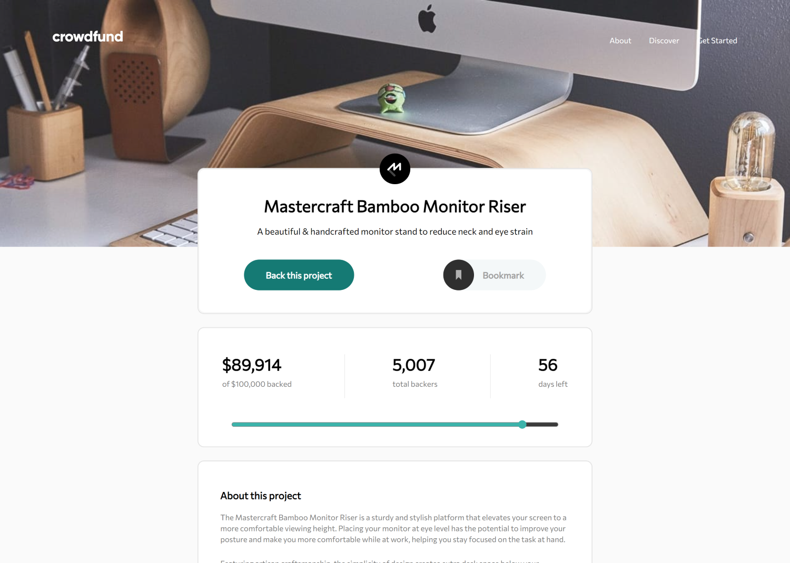

# "Crowdfunding Product Page"

## About the project

Product page for participatory funding where users can choose specific offers to increase funding. Users also have the option to bookmark products they wish to finance.

All stories are hosted on Chromatic at this [URL](https://65fea56c32d3f4e6395747c9-lhosmnuvto.chromatic.com/)

## Objectives

- Make a selection of which pledge to make
- See an updated progress bar and total money raised based on their pledge total after confirming a pledge
- See the number of total backers increment by one after confirming a pledge
- Toggle whether or not the product is bookmarked
- View the optimal layout depending on their device's screen size
- See hover states for interactive elements

## Coding Technologies Used

 
